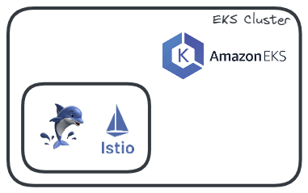
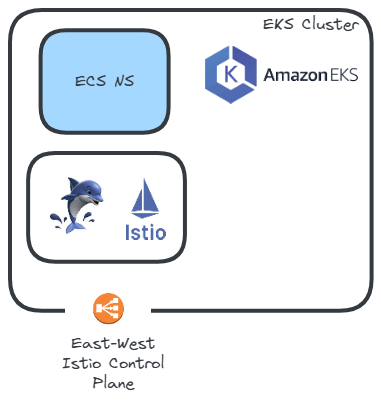
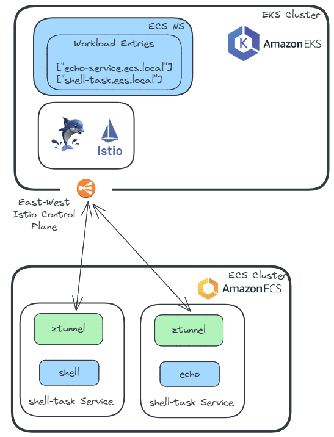
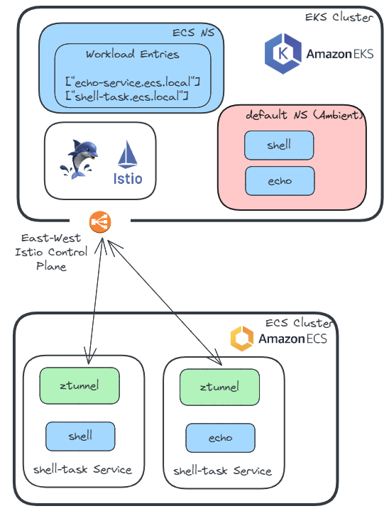
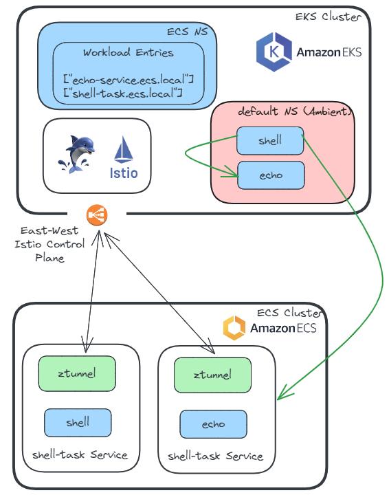
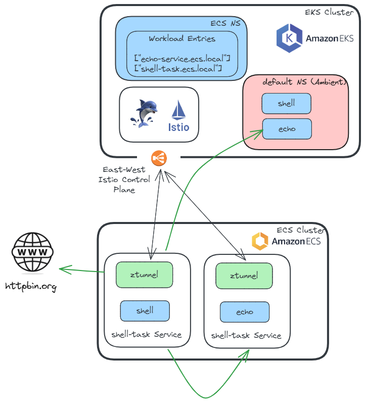
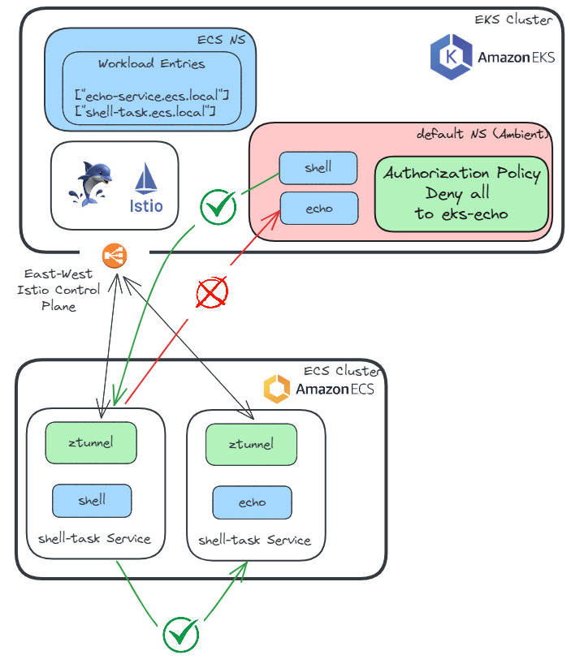
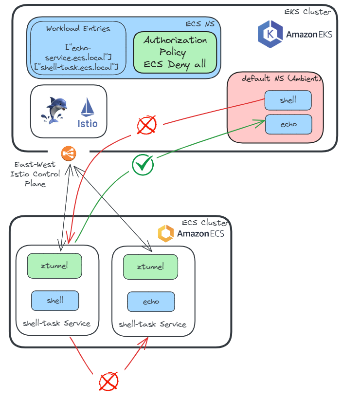
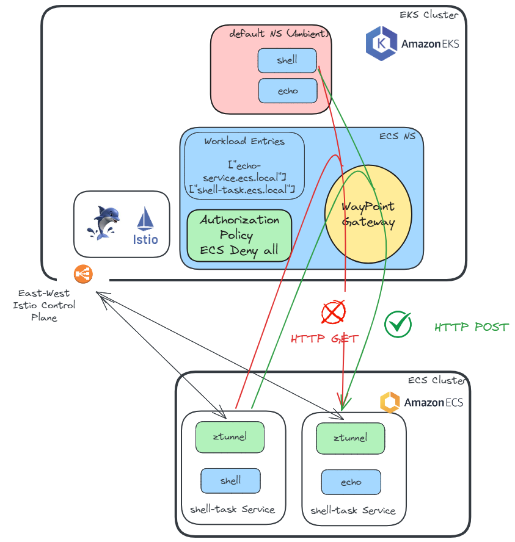

# ECS Ambient Integration - Demo

This guide provides detailed instructions to deploy ECS Ambient integration. Please note that this setup is being continuously improved based on feedback from users and the broader community. As the product evolves, it will be enhanced and refined into an even better version.

The setup has been validated for this phase, and following these steps should result in a successful integration. However, please be aware that changes may occur as we gather feedback and make improvements.

This guide work with a very specific alpha version of istio and istioctl to demo the EKS -> ECS multi cluster feature. With this feature you can integrate multiple ECS clusters and the task running in them with just one istio control plane in a single EKS cluster. This guide was testetd with 
version 1.28-alpha.c40069322c35edc88dc5d32477472e78a8d50e95 .

## Variables to Configure

The following environment variables are needed to configure your EKS cluster. These values specify the AWS region, cluster owner, EKS version, cluster name, number of nodes, and node types. Be sure to adjust these based on your needs. 

```bash
export AWS_REGION=us-east-1        # The AWS region where the cluster will be deployed
export OWNER_NAME=$(whoami)        # The name of the cluster owner (auto-fills with your username)
export EKS_VERSION=1.33            # Version of EKS to be used for the cluster
export CLUSTER_NAME=mcdemo      # Name of the EKS cluster. The ECS cluster names will be ecs-$CLUSTER_NAME-1 and ecs-$CLUSTER_NAME-2
export NUMBER_NODES=2              # The number of nodes in your EKS cluster
export NODE_TYPE="t2.medium"       # The instance type for the nodes in the EKS cluster
```

## Create EKS Cluster with `eksctl` Using Inline YAML

Populate the prepared temaplate with your current values and pass it to `eksctl` to create an AWS EKS cluster for Istio Ambient ECS demo.

```bash
eval "echo \"$(cat manifests/eks-cluster.yaml)\"" | eksctl create cluster --config-file -
```

## Deploy Kubernetes Gateway API CRDs

Gateway API is a new set of resources to manage service traffic in a Kubernetes-native way. Here, we're installing the most recent (as of January 2025) version of the Kubernetes Gateway API CRDs, which will be used by Istio for ingress.

```bash
kubectl apply -f https://github.com/kubernetes-sigs/gateway-api/releases/download/v1.3.0/standard-install.yaml
```

For more details, refer to the official [Gateway API documentation](https://gateway-api.sigs.k8s.io/guides/) and the Istio [documentation](https://istio.io/latest/docs/tasks/traffic-management/ingress/gateway-api/).

## Obtain the most recent binary

To obtain the appropriate **alpha version** of istioctl, which includes support for the ECS Multi cluster feature, please provide Solo.io with your operating system (OS) and architecture (ARCH) to receive the correct link to the archive.

Once you've received the appropriate `istioctl` archive, you'll need to extract the contents and clean up by deleting the archive file. The following example commands guide you:

```bash
wget https://storage.googleapis.com/gme-istio-testing-binaries/dev/1.28-alpha.c40069322c35edc88dc5d32477472e78a8d50e95/istio-1.28-alpha.c40069322c35edc88dc5d32477472e78a8d50e95-linux-amd64.tar.gz
tar xvzf istio-1.28-alpha.c40069322c35edc88dc5d32477472e78a8d50e95-linux-amd64.tar.gz --strip-components=2 istio-1.28-alpha.c40069322c35edc88dc5d32477472e78a8d50e95/bin/istioctl
rm istio*tar.gz
```

Confirm istioctl version:

```bash
./istioctl version
```

the expected output:

```output
Istio is not present in the cluster: no running Istio pods in namespace "istio-system"
client version: 1.28-alpha.c40069322c35edc88dc5d32477472e78a8d50e95
```

### Install Istio on the EKS Cluster in `Ambient` Mode with ECS Cluster Integration

This command installs Istio in Ambient mode with all the required settings for integrating with an ECS cluster. In addition to enabling Ambient mode, it also includes the **ECS cluster name**, which for this demo is based on the EKS cluster name defined earlier. By adding the ECS cluster information, the Istio control plane can automatically discover services running in ECS tasks, allowing for seamless service discovery across both Kubernetes and ECS.

Please note that the snippet currently points to a **private image repository** for Istio components, which is provided by Solo.io as explained earlier. Ensure you have access to this private repository or modify the image source to suit your environment by using the following command:

```bash
export HUB=us-east1-docker.pkg.dev/istio-enterprise-private/gme-istio-testing-images
export ISTIO_TAG=1.28-alpha.c40069322c35edc88dc5d32477472e78a8d50e95
```

Set the Gloo Mesh license key:
```bash
export GLOO_MESH_LICENSE_KEY=<key provided by Solo.io>
```

Now you're ready to install Istio in Ambient mode with ECS cluster integration:

```bash
cat <<EOF | ./istioctl install -y -f -
apiVersion: install.istio.io/v1alpha1
kind: IstioOperator
spec:
  profile: ambient
  # Make debugging easier
  meshConfig:
    accessLogFile: /dev/stdout
  values:
    global:
      hub: ${HUB}
      tag: ${ISTIO_TAG}
      network: eks
    license:
      value: ${GLOO_MESH_LICENSE_KEY}
    ztunnel:
      name: ztunnel
    cni:
      # Enable DNS proxy
      ambient:
        dnsCapture: true
    platforms:
      ecs:
        clusters: ecs-${CLUSTER_NAME}-1,ecs-${CLUSTER_NAME}-2
    pilot:
      env:
        # Required for full DNS proxying support
        PILOT_ENABLE_IP_AUTOALLOCATE: "true"
        # Required for some of the GW usage we are doing
        PILOT_ENABLE_ALPHA_GATEWAY_API: "true"
        # Required for our authentication to Istiod
        REQUIRE_3P_TOKEN: "false"
EOF
```

Expected output:

```output
        |\
        | \
        |  \
        |   \
      /||    \
     / ||     \
    /  ||      \
   /   ||       \
  /    ||        \
 /     ||         \
/______||__________\
____________________
  \__       _____/
     \_____/

✔ Istio core installed ⛵️
✔ Istiod installed 🧠
✔ CNI installed 🪢
✔ Ztunnel installed 🔒
✔ Installation complete
The ambient profile has been installed successfully, enjoy Istio without sidecars!
```

### Explanation of Parameters:

- `profile=ambient`: Specifies that we want to install Istio in Ambient mode.
- `meshConfig.accessLogFile`: Logs all traffic for debugging purposes.
- `dnsCapture=true`: Ensures that DNS traffic is captured by Ambient ztunnels.
- `platforms.ecs.clusters`: Speciefies the list of ECS Clusters.


### Label the network:

```bash
kubectl label namespace istio-system topology.istio.io/network=eks
```
This is used for multi-network deployments so Istio knows which network each workload belongs to and can leverage east-west gateway appropriately. 

This configuration allows the Istio control plane to interact with both Kubernetes and ECS services.

The EKS Cluster with Istio in Ambient mode is installed and ready to be used.



Let's move to ECS.

## Create the ECS Task Role

Following AWS best security practices and to avoid manual BOOTSTRAP token exchanged, an ECS Task Role will be created in AWS IAM, which `istioctl` will use. If the role already exists, the script will proceed without making changes. If the role does not exist, the script will create it.

The script will check if the ECS Task Role exists in your AWS account and if the Role is not present, it will:

- Create an IAM policy with the necessary permissions.
- Create an IAM role.
- Assign the newly created permissions to the newly created IAM role.

Additionally the script will **Export the ARNs of the roles (whether created or pre-existing)** as environment variables for use in the subsequent steps.

### How to Run:

Before proceeding with the next steps, you must **source** the script. This will check for the necessary roles, create them if they don't exist, and **export the role ARNs** to environment variables that are used in the following steps.

```bash
source scripts/build/create-iam.sh
```

Expected output:

```output
$ source scripts/build/create-iam.sh
Creating task role...
TASK_ROLE_ARN exported: arn:aws:iam::012345678912:role/ecs/ambient/eks-ecs-task-role
Creating task policy...kubectl exec -it $(kubectl get pods -l app=eks-shell -o jsonpath="{.items[0].metadata.name}") -- curl echo-service.ecs.local:8080
Task role is ready.
```

## Create Namespace for ECS

In this step, we create a new namespace in Kubernetes called `ecs`, which will be used to store configuration objects related to ECS workloads (such as `WorkloadEntries` and `ServiceEntries`).

```bash
for NO in ${CLUSTER_NAME}-1 ${CLUSTER_NAME}-2; do
  export ECS_NS=ecs-$NO                            
  export ECS_SERVICE_ACCOUNT_NAME=ecs-demo-sa      # This service account name is required for the demo

  kubectl create ns ${ECS_NS}
  kubectl label namespace ${ECS_NS} istio.io/dataplane-mode=ambient
  kubectl create sa $ECS_SERVICE_ACCOUNT_NAME -n $ECS_NS
  kubectl -n ${ECS_NS} annotate sa $ECS_SERVICE_ACCOUNT_NAME ecs.solo.io/role-arn=$(echo $TASK_ROLE_ARN | sed 's/\/ecs\/ambient//')
done
```
Expected output:

```output
namespace/ecs-mcdemo-1 created
namespace/ecs-mcdemo-1 labeled
serviceaccount/ecs-demo-sa created
serviceaccount/ecs-demo-sa annotated
namespace/ecs-mcdemo-2 created
namespace/ecs-mcdemo-2 labeled
serviceaccount/ecs-demo-sa created
serviceaccount/ecs-demo-sa annotated
```

## Enable Istiod to Accept Calls from ECS

In this step, we configure `istiod` to securely accept communication from the ECS cluster by creating a Gateway. This ensures that ztunnels in ECS can bootstrap workloads with the necessary security measures in place.

NOTE: If your east-west gateway uses an external Load Balancer (rather than the default Service of type LoadBalancer), you must add extra annotations to the Gateway resource to specify the external address. See the commented out annotations in east-west-cp.yaml.

```bash
kubectl apply -f manifests/east-west-cp.yaml
```



kubectl exec -it $(kubectl get pods -l app=eks-shell -o jsonpath="{.items[0].metadata.name}") -- curl echo-service.ecs.local:8080## Deploy ECS Task

A shell script is used to deploy ECS tasks. It will create two tasks - one will be used to initiate the calls and another one to receive the calls. The script will create the ECS cluster and deploy the tasks to it.

```bash
scripts/build/deploy-ecs-tasks-2-clusters.sh
```

Expected output:

```output
$ scripts/build/deploy-ecs-tasks-2-clusters.sh
Registering task definition for shell-task-definition.json...
Task definition shell-task-definition.json registered successfully.
Registering task definition for echo-task-definition.json...
Task definition echo-task-definition.json registered successfully.
All task definitions registered successfully.
ecs_vpc_id: vpc-07116fe0105d74ae7
Private Subnet IDs: subnet-043fee32952089cb7,subnet-0d114b43f59a03a3b
Security Group IDs: sg-02026b180ffc4e89a
ECS services script is completed.
Ingress authorized for EKS security group sg-01c8f4c9d9b44d80e (for ECS demo purposes).
```

**NOTE** The current ECS task definition for `shell` task sets the environment variable `ALL_PROXY=socks5h://127.0.0.1:15080`. This configuration ensures that all traffic is routed through the local SOCKS5 proxy at port 15080. As a result, all communication from the application or service running as an ECS Task is captured by the Istio Ambient (`ztunnel` component).

## Add ECS Service to Istio

In this step, ECS are added to the Istio service mesh. `istioctl` command bootstrap the ECS service with required secrets, configuration, and permissions to communicate with the Istio control plane.

```bash
./istioctl ecs add-service shell-task --cluster ecs-$CLUSTER_NAME-1 --namespace ecs-${CLUSTER_NAME}-1 --external
./istioctl ecs add-service echo-service --cluster ecs-$CLUSTER_NAME-1 --namespace ecs-${CLUSTER_NAME}-1 --external
./istioctl ecs add-service shell-task --cluster ecs-$CLUSTER_NAME-2 --namespace ecs-${CLUSTER_NAME}-2 --external
./istioctl ecs add-service echo-service --cluster ecs-$CLUSTER_NAME-2 --namespace ecs-${CLUSTER_NAME}-2 --external
```

the expected output:

```output
• Generating a bootstrap token for ecs-mcdemo-1/default...
• Fetched Istiod Root Cert
• Fetched Istio network (eks)
• Fetching Istiod URL...
  • Service "eastwest" provides Istiod access on port 15012
• Fetching Istiod URL (https://a59056c8f8825410abda45ba9ca16ccb-524419650.us-east-1.elb.amazonaws.com:15012)
• Workload is authorized to run as role "arn:aws:iam::253915036081:role/ecs/ambient/eks-ecs-task-role"
• Marking this workload as external to the network (pass --internal to override)
• Created task definition arn:aws:ecs:us-east-1:253915036081:task-definition/shell-task-definition:2
• Successfully enrolled service "shell-task" (arn:aws:ecs:us-east-1:253915036081:service/ecs-mcdemo-1/shell-task) to the mesh
• Generating a bootstrap token for ecs-mcdemo-1/default...
• Fetched Istiod Root Cert
• Fetched Istio network (eks)
• Fetching Istiod URL...
  • Service "eastwest" provides Istiod access on port 15012
• Fetching Istiod URL (https://a59056c8f8825410abda45ba9ca16ccb-524419650.us-east-1.elb.amazonaws.com:15012)
• Workload is authorized to run as role "arn:aws:iam::253915036081:role/ecs/ambient/eks-ecs-task-role"
• Marking this workload as external to the network (pass --internal to override)
• Created task definition arn:aws:ecs:us-east-1:253915036081:task-definition/echo-service-definition:2
• Successfully enrolled service "echo-service" (arn:aws:ecs:us-east-1:253915036081:service/ecs-mcdemo-1/echo-service) to the mesh
• Generating a bootstrap token for ecs-mcdemo-2/default...
• Fetched Istiod Root Cert
• Fetched Istio network (eks)
• Fetching Istiod URL...
  • Service "eastwest" provides Istiod access on port 15012
• Fetching Istiod URL (https://a59056c8f8825410abda45ba9ca16ccb-524419650.us-east-1.elb.amazonaws.com:15012)
• Workload is authorized to run as role "arn:aws:iam::253915036081:role/ecs/ambient/eks-ecs-task-role"
• Marking this workload as external to the network (pass --internal to override)
• Created task definition arn:aws:ecs:us-east-1:253915036081:task-definition/shell-task-definition:3
• Successfully enrolled service "shell-task" (arn:aws:ecs:us-east-1:253915036081:service/ecs-mcdemo-2/shell-task) to the mesh
• Generating a bootstrap token for ecs-mcdemo-2/default...
• Fetched Istiod Root Cert
• Fetched Istio network (eks)
• Fetching Istiod URL...
  • Service "eastwest" provides Istiod access on port 15012
• Fetching Istiod URL (https://a59056c8f8825410abda45ba9ca16ccb-524419650.us-east-1.elb.amazonaws.com:15012)
• Workload is authorized to run as role "arn:aws:iam::253915036081:role/ecs/ambient/eks-ecs-task-role"
• Marking this workload as external to the network (pass --internal to override)
• Created task definition arn:aws:ecs:us-east-1:253915036081:task-definition/echo-service-definition:3
• Successfully enrolled service "echo-service" (arn:aws:ecs:us-east-1:253915036081:service/ecs-mcdemo-2/echo-service) to the mesh
```

Now the demo setup looks like this. ECS Services are added to the Istio Ambient Mesh:
kubectl exec -it $(kubectl get pods -l app=eks-shell -o jsonpath="{.items[0].metadata.name}") -- curl echo-service.ecs.local:8080


## Deploy Test Pods in the EKS Cluster

To test the setup, deploy `shell` and `echo` applications in the default namespace of the previously created EKS cluster:

```bash
# Label the default namespace with ambient mode
kubectl label namespace default istio.io/dataplane-mode=ambient

# Deploy the test applications
kubectl apply -f manifests/eks-echo.yaml
kubectl apply -f manifests/eks-shell.yaml
```

Now the demo setup is complete and looks like this:



## Test EKS to ECS Communication

In this step, you will verify that EKS pods can communicate with ECS services
by making HTTP requests from an EKS pod to services running on EKS and ECS platform.
This confirms that the setup between EKS and ECS is functioning correctly.

Verify that EKS pods can communicate with ECS services:

Confirm communication between an EKS pod and an EKS service:

```bash
kubectl exec -it $(kubectl get pods -l app=eks-shell -o jsonpath="{.items[0].metadata.name}") -- curl eks-echo:8080
```

Expected output:

```outputkubectl exec -it $(kubectl get pods -l app=eks-shell -o jsonpath="{.items[0].metadata.name}") -- curl echo-service.ecs.local:8080
ServiceVersion=
ServicePort=8080
Host=eks-echo:8080
URL=/
Method=GET
Proto=HTTP/1.1
IP=192.168.116.225
RequestHeader=Accept:*/*
RequestHeader=User-Agent:curl/8.10.1
Hostname=eks-echo-5484d5bd99-hlk6w
```

Test communication from an EKS pod to an ECS service via ztunnel on the 1st ECS cluster

```bash
kubectl exec -it $(kubectl get pods -l app=eks-shell -o jsonpath="{.items[0].metadata.name}") -- curl echo-service.ecs-${CLUSTER_NAME}-1.local:8080
```

Expected output:

```output
ServiceVersion=
ServicePort=8080
Host=echo-service.ecs-mcdemo-1.local:8080
URL=/
Method=GET
Proto=HTTP/1.1
IP=192.168.79.89
RequestHeader=Accept:*/*
RequestHeader=User-Agent:curl/8.10.1
Hostname=ip-192-168-79-89.us-west-2.compute.internal
```

Test communication from an EKS pod to an ECS service via ztunnel on the 2nd ECS cluster

```bash
kubectl exec -it $(kubectl get pods -l app=eks-shell -o jsonpath="{.items[0].metadata.name}") -- curl echo-service.ecs-${CLUSTER_NAME}-2.local:8080
```

Expected output:

```output
ServiceVersion=
ServicePort=8080
Host=echo-service.ecs-mcdemo-2.local:8080
URL=/
Method=GET
Proto=HTTP/1.1
IP=192.168.79.89
RequestHeader=Accept:*/*
RequestHeader=User-Agent:curl/8.10.1
Hostname=ip-192-168-79-89.us-west-2.compute.internal
```

## TODO check things below this point - update diagrams


The diagram below demonstrates the flow of communication that was tested in this step:



## Test ECS to EKS Communication

For this demo, the security group settings are opened wide to simplify testing and ensure connectivity between ECS and EKS workloads. However, in a real-world deployment, **security groups should be configured more tightly** to restrict access based on specific CIDR ranges, protocols, and ports. Limiting access helps to maintain security and prevent unwanted traffic between ECS and EKS environments.

## Run the Test Script

Run the test script to demonstrate the communication between ECS and EKS workloads. The provided test script reads a list of curl commands from a file (in this case, `tests/ecs-test-commands.txt`) and executes each command on the ECS container using the `aws ecs execute-command` functionality. All traffic between ECS and EKS workloads is secured with mTLS, ensuring that it is encrypted, verified, and routed through the Istio ztunnel.

Run the Test Script: The script takes the file as input and executes each command sequentially on the ECS task, this tests ensures that calls from ECS contrainer can reach EKS, ECS and an externally hosted service.

```bash
scripts/test/call-from-ecs.sh tests/ecs-test-commands.txt
```

Expected output:

```output
$ scripts/test/call-from-ecs.sh tests/ecs-test-commands.txt
Cluster name not provided, trying to connect to the cluster ecs-demo-ztunnel-0
Using Task ID: 7121f914d8864596b14622ae1be8da61
-----
Running command: curl eks-echo.default:8080
ServiceVersion=
ServicePort=8080
Host=eks-echo.default:8080
URL=/
Method=GET
Proto=HTTP/1.1
IP=192.168.123.30
RequestHeader=Accept:*/*
RequestHeader=User-Agent:curl/8.11.1
Hostname=eks-echo-6c84bd6f6-97pls
-----
Running command: curl echo-service.ecs.local:8080
ServiceVersion=
ServicePort=8080
Host=echo-service.ecs.local:8080
URL=/
Method=GET
Proto=HTTP/1.1
IP=192.168.121.25
RequestHeader=Accept:*/*
RequestHeader=User-Agent:curl/8.11.1
RequestHeader=X-Forwarded-Proto:http
RequestHeader=X-Request-Id:995cb7ef-598b-4866-8ac1-fe844a22d1e1
Hostname=ip-192-168-121-25.us-west-1.compute.internal
-----
Running command: curl -I httpbin.org
HTTP/1.1 200 OK
Date: Wed, 29 Jan 2025 22:16:50 GMT
Content-Type: text/html; charset=utf-8
Content-Length: 9593
Connection: keep-alive
Server: gunicorn/19.9.0
Access-Control-Allow-Origin: *
Access-Control-Allow-Credentials: true
```

The diagram below demonstrates the flow of communication that was tested in this step:



## Advanced Use-Cases

For testing connectivity from ECS, we will continue using the `call-from-ecs.sh` script. This script finds the ECS tasks running the `shell` container in the ECS cluster created earlier and executes `curl` commands to the targets listed in the text file. The script allows you to validate connectivity and communication.

### Layer 4 Policies for EKS Workloads

In this section, you'll apply a **Deny All** L4 policy to EKS workloads and test various communications between ECS and EKS tasks.

First, apply the Deny All policy to block all traffic to EKS workloads:

```bash
kubectl apply -f manifests/eks-deny.yaml
```

After applying the policy, test the following scenarios:

- **ECS to ECS communication**: This should **succeed** since the policy only applies to EKS workloads.

```bash
scripts/test/call-from-ecs.sh tests/ecs-to-ecs.txt
```

- **ECS to EKS communication**: This should be **blocked** by the L4 policy.

```bash
scripts/test/call-from-ecs.sh tests/ecs-to-eks.txt
```

Finally, test if **EKS to ECS communication** still **succeeds** as no policy is blocking it:

```bash
kubectl exec -it $(kubectl get pods -l app=eks-shell -o jsonpath="{.items[0].metadata.name}") -- curl echo-service.ecs.local:8080
```

Below is a diagram illustrating the flow of communication that was tested in this step:



### Layer 4 Policies for ECS Workloads

Next, let's test a similar policy for ECS workloads.

First, remove the previous policy to ensure cleaner testing and apply a similar **Deny All** policy for ECS:

```bash
kubectl delete -n default authorizationpolicies eks-echo-deny
kubectl apply -f manifests/ecs-deny.yaml
```

Test the following scenarios:

- **ECS to ECS communication**: This should be **denied** by the freshly applied policy.

```bash
scripts/test/call-from-ecs.sh tests/ecs-to-ecs.txt
```

- **ECS to EKS communication**: This should now be **allowed** since no L4 policy is applied to EKS workloads.

```bash
scripts/test/call-from-ecs.sh tests/ecs-to-eks.txt
```

Finally, test if **EKS to ECS communication** is now **blocked** by the policy for ECS workloads:

```bash
kubectl exec -it $(kubectl get pods -l app=eks-shell -o jsonpath="{.items[0].metadata.name}") -- curl echo-service.ecs.local:8080
```

Below is a diagram illustrating the flow of communication that was tested in this step:



### Layer 7 Policies

For clarity, remove the previous policy:

```bash
kubectl delete -n $ECS_NS authorizationpolicies ecs-deny-all
```

Now, enable the Waypoint proxy in the ECS namespace:

```bash
./istioctl waypoint apply -n $ECS_NS --enroll-namespace
```

Apply an L7 policy to allow only **POST** operations:

```bash
kubectl apply -f manifests/post-only-allow.yaml
```

Test the following scenarios:

- **POST requests**: These should be **allowed**.

```bash
scripts/test/call-from-ecs.sh tests/ecs-to-ecs-post.txt
kubectl exec -it $(kubectl get pods -l app=eks-shell -o jsonpath="{.items[0].metadata.name}") -- curl -X POST echo-service.ecs.local:8080
```

- **GET requests**: These will be **denied** with `RBAC: access denied`.

```bash
scripts/test/call-from-ecs.sh tests/ecs-to-ecs-get.txt
kubectl exec -it $(kubectl get pods -l app=eks-shell -o jsonpath="{.items[0].metadata.name}") -- curl -X GET echo-service.ecs.local:8080
```

The diagram below illustrates L7 Policy implementation via Waypoint Proxy with applied L7 Authorization Policy:



To reset the environment, delete the L7 policy:

```bash
kubectl delete -f manifests/post-only-allow.yaml
```

# Cleanup

To clean up the resources created during this demo, you can use the following commands:

First run the cleanup script for the ECS artifacts:

```bash
scripts/cleanup/ecs-2cluster-cleanup.sh
```

use separate script to delete IAM roles and policies:

```bash
scripts/cleanup/iam-cleanup.sh
```

Finally, delete the EKS cluster:

```bash
eksctl delete cluster --name ${CLUSTER_NAME} --region ${AWS_REGION}
```

If you encounter any issues during testing, please reach out to your Solo.io representative for assistance.
